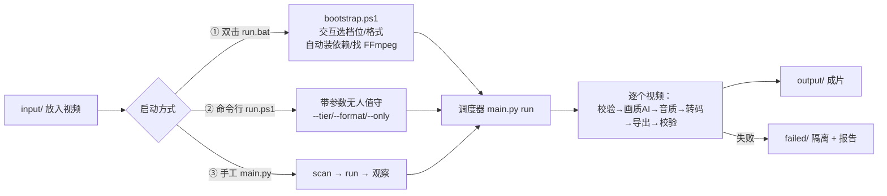
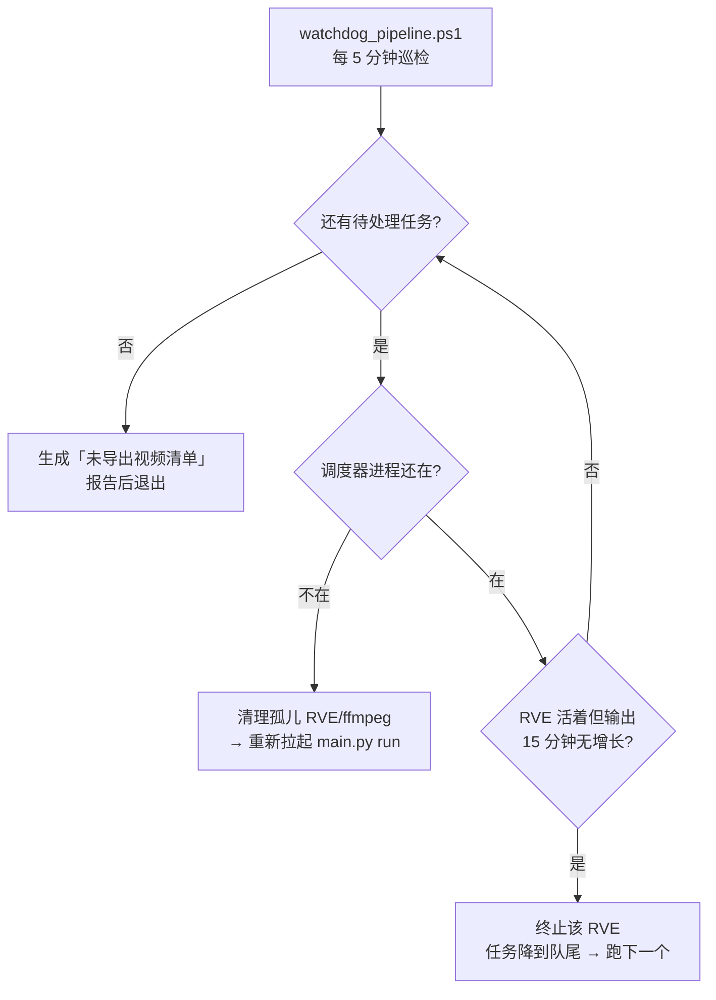

# Video Pipeline — 单机无人值守批量视频处理系统

把一堆**不规则的老视频**（WMV/AVI/MP4 混合、低分辨率、可能有压缩伪影）自动修复成
**统一交付格式**（默认 MP4 / H.264 / AAC 48kHz —— Windows、安卓、iOS 的默认播放器
都能直接打开），全程本地、可无人值守、可断点续跑。

> 设计取向：**稳定性 > 吞吐量**。宁可慢一点、失败隔离得更干净，也不要跑一晚上
> 早上发现整批卡死或全部报废。

| 能力 | 说明 |
| --- | --- |
| 画质 AI 修复 | REAL-Video-Enhancer 2.4.1：2x 超分（必开）+ 1x 压缩伪影修复（按预算自动决定） |
| 音频处理 | 默认**不做 AI 降噪**（只重编码，保住源声场）；可开 DeepFilterNet（自动分段防 OOM） |
| 格式规范化 | 统一容器/编码/采样率，并强制**跨平台可播参数**（见 [2.5](#25-跨平台播放兼容性windows--android--ios)），QSV → NVENC → CPU 自动降级 |
| 批量与容错 | 磁盘/内存感知调度、失败隔离、断点续跑、内存耗尽自动跳过并重排 |
| 无人值守 | 守护脚本自动拉起被杀掉的调度器、终止卡死的 RVE；队列跑空自动出报告 |
| 进度可视化 | 终端 TUI + 本地 Web 看板（只读，不与调度器争锁） |
| 完全离线 | 模型与 FFmpeg 都在本地，运行期零网络请求 |

---

## 目录

- [1. 自动化运行完整步骤](#1-自动化运行完整步骤)
- [2. 自定义输出视频格式](#2-自定义输出视频格式)
- [3. 按设备估算处理速度](#3-按设备估算处理速度)
- [4. 全部可修改参数](#4-全部可修改参数)
- [5. 常见问题排查与解决](#5-常见问题排查与解决)
- [附录 A 目录结构](#附录-a-目录结构)
- [附录 B 错误码与异常分类](#附录-b-错误码与异常分类)
- [附录 C 实测性能基准](#附录-c-实测性能基准)
- [附录 D 修复档位详解](#附录-d-修复档位详解)

---

## 1. 自动化运行完整步骤

### 1.1 环境要求

| 项目 | 最低 | 推荐 | 说明 |
| --- | --- | --- | --- |
| 操作系统 | Windows 10 x64 | Windows 11 x64 | 脚本是 PowerShell，路径按 Windows 写 |
| Python | 3.11 | 3.11 | 3.12+ 未见问题，3.10 以下不支持 |
| 内存 | 8 GB | **16 GB 起** | AI 阶段峰值约 2.3~2.7 GB，且要留余量；8GB 机器建议只跑 `--tier light` |
| GPU | 无（纯转码） | NVIDIA ≥8 GB VRAM | AI 超分必须有 CUDA；无卡时自动降级为纯转码/CPU 编码 |
| 磁盘 | 30 GB | 50 GB+ | 源大小 × 1.5 + 成片；阈值见 [参数表](#4-全部可修改参数) |
| FFmpeg | 必需 | 仓库自带即可 | `scripts/bootstrap.ps1` 会自动下载到 `.tools\ffmpeg\` |

> **内存是这台机器的第一约束**：AI 阶段（RVE 推理 + 它自己拉起的编码 ffmpeg）实测
> 峰值 2.3 GB 左右，若机器同时跑着浏览器/IDE，可用内存不足时会以
> 「`Unable to allocate 2.25 MiB`」的形式崩在 RVE 的读帧线程里。详见
> [5.2 内存耗尽](#52-现象-rve-报-unable-to-allocate-225-mib-或-memoryerror)。

### 1.2 三种启动方式



**① 双击 `run.bat`（最省事）** — 会依次：找/建虚拟环境 → 装依赖 → 定位 FFmpeg
（仓库内 `.tools\ffmpeg` → 上级目录 → PATH → 自动下载）→ 检查 AI 组件 → 交互式问
「输出格式」与「处理范围」→ 执行 `scan` + `run`。

**② 命令行 `scripts\run.ps1`（推荐用于无人值守）**

```powershell
# 只处理 input\课程，输出 mp4（默认），档位自动
powershell -ExecutionPolicy Bypass -File scripts\run.ps1 --tier auto --only 课程

# 完全无人值守，不询问任何问题
powershell -ExecutionPolicy Bypass -File scripts\run.ps1 --no-prompt --tier standard --format mp4

# 只做转码（不做 AI），验证链路
powershell -ExecutionPolicy Bypass -File scripts\run.ps1 --no-ai --only 课程
```

**③ 手工分步（排障时最有用）**

```powershell
$env:PATH = "$PWD\.tools\ffmpeg;$env:PATH"   # 让 ffmpeg/ffprobe 可用（新版已内置兜底，可省）
python main.py doctor      # 环境自检
python main.py scan        # 扫描 input/ 建队列
python main.py estimate    # 只预估耗时与档位，不处理任何文件
python main.py run         # 开跑（Ctrl+C 安全中断，重启续跑）
python main.py status      # 看队列与资源
python main.py monitor     # 终端实时进度表
python main.py dashboard   # 本地 Web 看板（127.0.0.1:8765）
python main.py verify      # 校验 output/ 全部成片
```

### 1.3 依赖安装（从零开始）

```powershell
# 1) 基础依赖（主环境，只跑调度器/转码，不装 torch）
py -3.11 -m venv .venv
.\.venv\Scripts\python.exe -m pip install -r requirements.txt

# 2) FFmpeg / FFprobe：放到 .tools\ffmpeg\（两个 exe），或装到 PATH
#    也可以交给 scripts\bootstrap.ps1 自动下载（约 30 MB，来自 npmmirror 镜像）

# 3) 两个 AI 组件（可选；缺失时流水线自动退化为纯转码，不会崩）
powershell -ExecutionPolicy Bypass -File scripts\setup_ai_tools.ps1 -Cuda
#    -Cuda 会用 CUDA 版 torch（RTX 卡必须）；
#    不加则装 CPU 版，只能做功能验证（比 GPU 慢 20~30 倍）

# 4) 自检
python main.py doctor
.\.venv-rve\Scripts\python.exe scripts\verify_cuda.py --bench   # 复标定 AI 速度
```

安装完成后应能看到：`.venv\`（主环境）、`.venv-rve\`（RVE 专用，numpy 2.x）、
`.tools\ffmpeg\`、`tools\models\`（超分与压缩修复模型）。

### 1.4 子命令一览

| 命令 | 作用 | 常用参数 |
| --- | --- | --- |
| `scan` | 扫描 `input/` 建/更新任务队列 | `--only 子目录` |
| `run` | 无人值守主循环（**核心**） | `--tier` `--format` `--no-ai` |
| `status` | 队列统计 + 磁盘/内存/显存/编码器 | — |
| `estimate` | **只探测不处理**：逐文件预估耗时与自动档位 | `--input 目录` |
| `tiers` | 列出三档修复范围/深度/实测耗时 | — |
| `doctor` | 依赖与环境自检 | — |
| `verify` | 逐个 ffprobe 校验 `output/` 成片 | — |
| `retry` | 把 `FAILED_FINAL` 重置为待跑 | — |
| `cleanup` | 手动清理 `work/` 临时文件 | — |
| `monitor` | 终端实时进度表（原地重绘） | `--once` `--ascii` `--interval` |
| `dashboard` | 本地 Web 看板（只读） | `--port` `--open` `--allow-remote` |

全局参数（写在子命令**之前**）：`--config 文件` `--format {mp4,mkv,mov,webm,avi}`
`--tier {auto,light,standard,full}` `--only 子目录`（可重复）`--input 目录` `--no-ai`。

### 1.5 无人值守：守护脚本

长批次真正会「停住」的故障只有两类，都交给守护脚本：



```powershell
# 启动守护（必须用 WMI，见下方注意）
$root = "E:\WorkBuddy\video-transfer-tools\video_pipeline"
Invoke-CimMethod -ClassName Win32_Process -MethodName Create -Arguments @{
  CommandLine = "powershell.exe -NoProfile -ExecutionPolicy Bypass -File `"$root\scripts\watchdog_pipeline.ps1`""
  CurrentDirectory = $root }
```

> **注意**：不要用 `Start-Process` 起守护——它在自动化工具会话结束时会连带被杀掉，
> 守护就白起了。守护日志写在 `logs\watchdog.log`（每 5 分钟一行）。

**为什么需要它**（都是实测踩过的坑）：

- 调度器曾被系统在内存压力下**静默杀掉**（无日志、无崩溃记录），队列就此停 2 小时；
- RVE 会**挂死**在启动阶段（一个字节都不写），调度器只能陪它等到 4 小时超时；
- 调度器被杀后会留下**孤儿 ffmpeg**，仍占着 `work\current\video_ai.mp4`，导致下一个
  任务卡在「文件被占用」。

### 1.6 暂停 / 恢复 / 重跑 / 清理

| 场景 | 做法 |
| --- | --- |
| 临时暂停 | 在 `run` 窗口按 `Ctrl+C`（状态已落库，重启续跑，不重做已完成阶段） |
| 续跑 | 再次 `python main.py run`（已完成阶段按产物存在性跳过） |
| 某个视频失败 | 看 `failed\job_XXXX\` 与 `logs\jobs\XXXX.log`；修好后 `python main.py retry` 再 `run` |
| 想让它从某个阶段重做 | 删掉 `work\current\` 下对应产物（或用 `cleanup`），再 `run` |
| 清理临时文件 | `python main.py cleanup`（只动 `work\`，绝不碰 `input/`、`output/`） |
| 交付验收 | `python main.py verify`（逐文件 ffprobe 校验时长/流/大小） |

---

## 2. 自定义输出视频格式

### 2.1 支持的格式（`--format` / `output.container`）

格式同时决定**容器 + 视频编码 + 音频编码 + 音频码率**，不是只换个后缀：

| `--format` | 容器 | 视频编码 | 音频编码 | 音频码率 | 适用场景 |
| --- | --- | --- | --- | --- | --- |
| `mp4`（默认） | MP4 | **H.264** | AAC | 320k | 通用交付；Windows / 安卓 / iOS 默认播放器通吃 |
| `mkv` | Matroska | H.265/HEVC | AAC | 320k | 想保留更多音轨/字幕、无 faststart 需求 |
| `mov` | MOV | H.265/HEVC | AAC | 320k | 进剪辑软件（Premiere/FCP） |
| `webm` | WebM | VP9 | Opus | **256k** | 网页播放（opus 上限 256k，写 320k 会被 ffmpeg 拒绝） |
| `avi` | AVI | H.264 | MP3 | 320k | 老播放设备/老编辑软件的兼容兜底 |

> 选 H.265 的分支（mkv / mov）也会被自动补上 `-profile:v main -tag:v hvc1`，
> 不会产出移动端拒播的 `hev1`。原因与完整参数表见 [2.5](#25-跨平台播放兼容性windows--android--ios)。

### 2.2 三种指定方式（优先级从高到低）

```powershell
# ① 命令行（会覆盖 config.yaml）
python main.py --format mkv run

# ② 双击 run.bat 的交互菜单里选

# ③ 写死在 config.yaml（长期生效）
output:
  container: "mp4"
```

### 2.3 输出相关参数

| 参数 | 作用 | 取值 | 默认 | 备注 |
| --- | --- | --- | --- | --- |
| `output.container` | 容器 | `mp4` `mkv` `mov` `webm` `avi` | `mp4` | 改它会自动带上对应编码组合 |
| `output.video_codec` | 视频编码 | `h264` `hevc` `av1` | `h264` | 手动写时注意与容器匹配；profile / codec tag 会自动配套 |
| `output.pix_fmt` | 像素格式 | `yuv420p` 等 | `yuv420p` | **别改**。4:4:4 / 10bit 移动端默认播放器一律不支持 |
| `output.audio_codec` | 音频编码 | `aac` `mp3` `opus` … | `aac` | webm 要 `opus` |
| `output.audio_bitrate` | 音频码率 | 如 `128k`/`320k` | `320k` | opus 上限 256k |
| `output.sample_rate` | 音频采样率 | `44100` / `48000` | `48000` | 源多为 22050Hz，统一升到 48k |
| `output.keep_subtitles` | 是否保留字幕流 | `true`/`false` | `true` | — |
| `output.keep_metadata` | 是否保留元数据 | `true`/`false` | `true` | — |

### 2.4 编码后端自动降级链

`encoder.prefer: ["qsv","nvenc","cpu"]` → 依次探测**目标编码对应的**硬件编码器
（默认 h264 时是 `h264_qsv` / `h264_nvenc` / `libx264`），**并且运行失败也会继续降级**
（编码器存在 ≠ 硬件可用）。想要更快可把 `cpu_preset` 换成 `fast`/`veryfast`（体积略增），
或把 `qsv_preset` 换 `fast`。

> 小知识：`-movflags +faststart` 只对 mp4/mov 有效，mkv/webm/avi 传了会直接报错，
> 程序已按容器自动判断。

### 2.5 跨平台播放兼容性（Windows / Android / iOS）

**这一节是「成片能不能在默认播放器里播」的硬约束，不要为了省体积或提高画质绕过它。**

#### 2.5.1 背景：一次真实的"格式不支持"

上一轮交付的 MP4 在**安卓平板的默认播放器**里报「格式不支持 / 视频无法播放」，
而**同片源的 `input/` 文件却能正常播放**。用 ffprobe 对比后确认与分辨率/码率/帧率无关
（这几项本来都合规），坏在三个编码层参数上：

| 参数 | `input/`（能播） | 旧版导出（不能播） | 移动端要求 |
| --- | --- | --- | --- |
| 视频编码 | h264 `avc1` | **hevc `hev1`** | H.264 必支持；HEVC 必须 **`hvc1`** |
| Profile | High | **Rext（Range Extensions）** | 只保证 Main / High（8bit） |
| 像素格式 | yuv420p | **yuv444p** | 只保证 **4:2:0 / 8bit** |
| 分辨率 / 帧率 / 码率 | 712×400 / 25fps / 650k | 1424×800 / 25fps / 723k | 均合规，**不是原因** |
| 音频 | aac HE-AAC 48k | aac LC 48k | 均合规，**不是原因** |

根因链路（两处叠加）：

1. **中间产物的像素格式被带偏成 4:4:4。** RVE 后端补 `-pix_fmt` 的代码写在
   `tools/backend/src/FFmpegBuffers.py` 的 `custom_encoder is None` 分支里；而流水线
   为了限制 x264 线程内存传了 `--custom_encoder`，导致 RVE **不再补 `-pix_fmt`**。
   它的写帧输入是 rawvideo `rgb24`，ffmpeg 自动协商挑到了 **yuv444p** →
   中间产物变成 `H.264 High 4:4:4 Predictive` → 下游编码器原样继承。
2. **HEVC 的 codec tag 是 ffmpeg 默认的 `hev1`。** `hev1` 表示参数集放在码流内，
   而大量安卓/iOS 硬件解码器只认 `hvc1`（参数集放进 `hvcC` box），直接拒收。

代码里对应的三处修复：

| 位置 | 改动 |
| --- | --- |
| `config.yaml` → `video_repair.extra_args` | 给 `--custom_encoder` 补上 `-pix_fmt yuv420p` |
| `adapters/ffmpeg.py` → `compat_video_args()` | 任何转码都强制 `pix_fmt` + `profile` + `codec tag` |
| `pipeline/verifier.py` → `compat_problems()` | VERIFY 阶段断言，不合规直接判失败而不出片 |

#### 2.5.2 兼容参数矩阵

程序会根据 `output.video_codec` **自动配套**下列参数（改 `video_codec` 即可，
不需要手工同步 profile 或 tag）：

| 目标编码 | `-pix_fmt` | `-profile:v` | MP4 codec tag | 说明 |
| --- | --- | --- | --- | --- |
| **h264**（默认） | `yuv420p` | `high` | `avc1` | 三端默认播放器**原生支持**，无需任何额外解码器 |
| hevc | `yuv420p` | `main` | **`hvc1`** | 体积省约 40%，但要求设备带 HEVC 硬解 |
| vp9 / av1 | 由容器决定 | — | — | 走 webm/新容器，播放器支持度另算 |

> `-level` **故意不写死**：让编码器自动取"够用的最低 level"，兼容面反而更广；
> 写死 4.1 会让 4K 片源因 level 不足而编码失败。

#### 2.5.3 怎么切回 H.265

```yaml
# config.yaml
output:
  video_codec: "hevc"    # 只改这一行；profile=main / tag=hvc1 会自动配套
```

或命令行加 `--format mkv`（mkv 分支默认走 HEVC）。**不要**自己往 ffmpeg 参数里写
`-tag:v hev1`，也不要关掉 `output.pix_fmt`。

#### 2.5.4 修复已交付的旧文件（无需重跑 AI）

AI 阶段跑一次要几十分钟到几小时，但参数问题只出在**最后一层编码**，
所以旧成片可以直接重编码补救（4:4:4 → 4:2:0 只影响色度细节，肉眼几乎无差）：

```powershell
# H.264 版（三端通吃，推荐）
ffmpeg -y -i "output\剧集\S01E04_seg30min.mp4" `
  -c:v libx264 -preset medium -crf 20 -pix_fmt yuv420p -profile:v high `
  -c:a copy -movflags +faststart "output\剧集\S01E04_seg30min.fixed.mp4"

# 要保留 HEVC 的话：只补 profile + tag + 像素格式
ffmpeg -y -i "output\xxx.mp4" -c:v libx265 -crf 20 `
  -pix_fmt yuv420p -profile:v main -tag:v hvc1 `
  -c:a copy -movflags +faststart "output\xxx.hvc1.mp4"
```

#### 2.5.5 怎么验证一个文件"三端都能播"

```powershell
# ① 参数断言：profile 不能是 Rext，pix_fmt 必须是 yuv420p，tag 不能是 hev1
ffprobe -v error -select_streams v:0 `
  -show_entries stream=codec_name,profile,pix_fmt,codec_tag_string `
  -of default=nw=1 "成片.mp4"

# ② 码流自检：无任何输出即为完整可解
ffmpeg -v error -i "成片.mp4" -f null -

# ③ 真机实测：拷进平板后用**系统默认播放器**打开，确认能起播、能拖进度、能到片尾
adb push "成片.mp4" /sdcard/Movies/
# 若被拒，直接看它拒绝了哪个参数：
adb logcat | Select-String "MediaCodec|NuPlayer|OMX"
```

预期结果：`codec_name=h264`、`profile=High`、`pix_fmt=yuv420p`、
`codec_tag_string=avc1`；音频 `aac / LC / 48000 Hz`。

---

## 3. 按设备估算处理速度

### 3.1 成本模型（这是估时的核心）

画质 AI 耗时按「**单帧成本可分解**」建模（`pipeline/planner.py`）：

```
秒/帧 = upscale_s_per_mp  × 输出百万像素      ← 2x 超分（必开）
      + decompress_s_per_mp × 输入百万像素    ← 1x 压缩伪影修复（可选，慢得多）
总耗时 ≈ 帧数 × 秒/帧 + job_overhead_seconds(30s)
RVE 超时 = max(timeout_floor_seconds, 估计值 × timeout_safety_factor(3.0) + 600)
```

默认标定值（**RTX 4060 Laptop 8G / CUDA / tile=0** 上实测）：

| 参数 | 默认值 | 含义 |
| --- | --- | --- |
| `upscale_s_per_mp` | `0.0465` | 每百万**输出**像素的超分耗时（秒） |
| `decompress_s_per_mp` | `1.64` | 每百万**输入**像素的压缩修复耗时（秒）——比超分贵约 35 倍 |
| `job_overhead_seconds` | `30` | 模型加载等固定开销 |

**算一遍就懂了**（本机实测吻合）：

| 片源 | 档位 | 计算 | 预计 | 实测 |
| --- | --- | --- | --- | --- |
| 712×400 / 50 帧 | 仅 2x | 50 × (0.0465 × 1.139) | 2.6 s | 2.65 s |
| 712×400 / 50 帧 | 1x+2x | 50 × (0.053 + 1.64 × 0.285) | 26 s | 25.98 s |
| 1024×768 / 2x / 25 分钟 | 仅 2x | 7500 × (0.0465 × 3.145) | 18 min | ≈20 min |
| 1024×768 / 2x / 40 分钟 | **1x+2x** | 12010 × (0.146 + 1.64 × 0.786) | 4.8 h | ≈5.5 h |

### 3.2 三步估算你的机器能跑多快

1. **先跑自检标定**（换显卡/换分辨率档必须做）：

   ```powershell
   .\.venv-rve\Scripts\python.exe scripts\verify_cuda.py --bench
   ```
   它会打印每帧实测耗时；用 `秒/帧 ÷ 输出百万像素` 反推 `upscale_s_per_mp`。

2. **写回配置**：

   ```yaml
   video_repair:
     auto:
       upscale_s_per_mp: 0.0465       # 用你的实测值替换
       decompress_s_per_mp: 1.64
   ```

3. **用命令看整批结论**（不处理任何文件）：

   ```powershell
   python main.py estimate --only 课程
   ```
   输出含：总时长、单文件预算、完整档/快速档预估小时数、逐文件档位与理由。

### 3.3 不同设备的粗略倍率（以本机 4060 Laptop 为 1×）

| 设备档位 | 相对速度 | 68 分钟 712×400 片源（仅 2x） | 建议 |
| --- | --- | --- | --- |
| RTX 4090 / 4080 台式 | 2.5 ~ 3.5× | 30 ~ 40 分钟 | 可考虑 4x 模型 |
| RTX 4070 / 4060 台式 | 1.4 ~ 2× | 45 ~ 65 分钟 | 默认档位即可 |
| **RTX 4060 Laptop（本机）** | **1×** | **约 1.5 小时** | 默认档位；`tile=512` 更稳 |
| GTX 1660 / 6G | 0.4 ~ 0.6× | 2.5 ~ 4 小时 | 关掉 1x 修复，只用 2x |
| 纯 CPU（无独显） | 0.03 ~ 0.05× | 2 ~ 3 天 | 只用 `--tier light` 或 `--no-ai` |
| Apple Silicon（M 系，MPS） | 0.3 ~ 0.6× | 3 ~ 5 小时 | 需 `device: mps` |

> 这些是**数量级参考**：真正准的是你自己的 `--bench` 结果。内存不足时（见 5.2）
> 实际速度会更差——因为会被崩掉重跑。

### 3.4 影响速度的因素（按影响从大到小）

1. **档位**：1x 压缩修复比 2x 超分慢约 9~35 倍（这是最大变量）；
2. **分辨率与帧率**：成本 ≈ 输出像素数 × 帧数，成正比；
3. **GPU 型号与功耗模式**（笔记本的静音/性能模式差可达 2 倍）；
4. **`tile`**：分块推理会把大图拆小，速度略降但峰值内存明显下降；
5. **转码阶段**：`hevc` + `cpu_preset` / `crf`，以及是否有 QSV/NVENC；
6. **磁盘/内存压力**：内存不足会触发跳过与重排，总体变慢。

---

## 4. 全部可修改参数

> 全部写在 `config.yaml`；以 `./` 开头的路径**相对配置文件所在目录**解析。
> 「推荐」列是本机 16GB / 8GB 显存 / 50GB 磁盘下的建议值。

### 4.1 路径与资源

| 参数 | 作用 | 取值 | 默认 | 推荐 |
| --- | --- | --- | --- | --- |
| `paths.input` | 源视频目录（只读，绝不修改） | 相对/绝对路径 | `./input` | 保持 |
| `paths.work` | 中间产物目录 | 同上 | `./work` | 与 `input` 同盘（重命名更快） |
| `paths.output` | 成片目录（镜像 `input` 子目录结构） | 同上 | `./output` | 保持 |
| `paths.failed` | 失败隔离目录 | 同上 | `./failed` | 保持 |
| `paths.logs` | 日志目录 | 同上 | `./logs` | 保持 |
| `paths.database` | SQLite 作业库（断点续跑依据） | 同上 | `./pipeline.db` | 不要放网络盘 |
| `resources.cpu_cores` | 声明的 CPU 核数（仅记录） | 正整数 | `22` | 按实机改 |
| `resources.ram_total_gb` | 声明的内存总量（仅记录/校验） | 正整数 | `16` | 按实机改 |
| `resources.ram_soft_limit_percent` | 超过则**禁止启动新阶段**（等待） | 60~99 | `92` | 16GB 机器保持 92；32GB 可降 85 |
| `resources.ram_hard_limit_percent` | 硬上限（暂停/降级） | 90~99 | `97` | 保持 |
| `resources.max_video_ai_jobs` | 同时跑几个视频 AI | **1** | `1` | 不要改（显存不够只会更慢） |
| `resources.max_audio_jobs` | 同时跑几个音频 AI | 1~2 | `1` | 保持 |
| `resources.max_transcode_jobs` | 同时跑几个转码 | 1~2 | `1` | 保持 |
| `scheduler.max_active_video_workspaces` | 同时占用工作区的视频数 | **1** | `1` | 不要改 |
| `scheduler.poll_interval_seconds` | 主循环轮询间隔 | ≥5 | `10` | 保持 |

### 4.2 磁盘（第一优先级调度约束）

| 参数 | 作用 | 取值（GB） | 默认 | 推荐 |
| --- | --- | --- | --- | --- |
| `disk.total_available_gb` | 声明可用空间（仅记录） | 正整数 | `50` | 按实机 |
| `disk.safe_start_gb` | ≥此值才启动**新**任务 | — | `30` | 保持 |
| `disk.pause_new_jobs_gb` | 低于此值只继续已开始的任务 | — | `20` | 保持 |
| `disk.cleanup_gb` | 低于此值触发紧急清理 | — | `15` | 保持 |
| `disk.emergency_stop_gb` | 低于此值整条流水线暂停 | — | `10` | 保持 |
| `disk.safety_margin_gb` | 单文件空间评估的安全余量 | — | `8` | 保持 |
| `disk.video_temp_multiplier` | 单文件空间预估系数（源 × 该值） | 1.0~3.0 | `1.5` | 长片多可调 2.0 |
| `disk.audio_temp_multiplier` | 音频中间文件系数 | — | `0.2` | 保持 |
| `disk.output_multiplier` | 成片大小系数 | — | `1.2` | 保持 |

### 4.3 视频 AI 修复（`video_repair`）

| 参数 | 作用 | 取值 | 默认 | 推荐 |
| --- | --- | --- | --- | --- |
| `enabled` | 是否启用画质 AI | `true`/`false` | `true` | 有 GPU 就 true |
| `tier` | 修复档位 | `auto` `light` `standard` `full` | `auto` | 批量用 `auto` |
| `backend` | 适配器后端 | `real-video-enhancer` / `none` | 前者 | 保持 |
| `infer_backend` | RVE 推理后端 | `pytorch` `ncnn` `tensorrt` | `pytorch` | 保持 |
| `device` | 推理设备 | `cuda` / `cpu` | `cuda` | 有 N 卡用 cuda |
| `precision` | 精度 | `auto` `float16` `float32` | `auto` | 保持 |
| `gpu_index` | 用哪块卡 | 0~n | `0` | 保持 |
| `deblock` | 是否允许传压缩修复模型 | `true`/`false` | `true` | 保持（真实是否用由 planner 定） |
| `upscale` | 是否超分 | `true`/`false` | `true` | 保持 |
| `scale_mode` | 倍率策略 | `auto` `1x` `2x` `4x` | `auto` | 不要盲目 4x |
| `interpolation` | 是否插帧 | `true`/`false` | `false` | 保持 false |
| **`tile`** | 分块推理尺寸 | `0`（整帧）/ `256` / `512` / `128`(CPU) | `512` | 内存紧张保持 512；显存充足可 0 |
| `crf` | RVE 中间产物质量 | 0~23 | `16` | 保持（中间产物要够好） |
| `encoder` | 中间产物编码器 | `libx264` / `libx265` | `libx264` | 保持 |
| `timeout_seconds` | RVE 超时**下限** | ≥3600 | `14400` | 不用改（实际值由 planner 推） |
| `executable` | RVE 解释器 | 路径 | `./.venv-rve/Scripts/python.exe` | 保持 |
| `ffmpeg_path` | RVE 内部调用的 ffmpeg | 路径 | `./.tools/ffmpeg/ffmpeg.exe` | 保持 |
| `extra_args` | 追加到 RVE 命令行的参数 | 列表 | 见下 | **已内置降内存参数，勿删** |
| `auto.enabled` | 是否自动决定 1x 修复 | `true`/`false` | `true` | 保持 true |
| `auto.total_budget_hours` | 单次 run 的画质 AI 总预算 | 1~100 | `12` | 想让它更常用完整档就调大 |
| `auto.upscale_s_per_mp` | 超分速度标定 | 正数 | `0.0465` | **用 --bench 复标定** |
| `auto.decompress_s_per_mp` | 压缩修复速度标定 | 正数 | `1.64` | 同上 |
| `auto.timeout_safety_factor` | 超时安全系数 | 1.5~5 | `3.0` | 保持 |
| `models.upscale."2x"` | 2x 超分模型路径 | 路径 | `./tools/models/2x_OpenProteus...pth` | 保持 |
| `models.decompress` | 1x 压缩修复模型路径（空=不具备该能力） | 路径/`null` | `./tools/models/1xDeH264_realplksr.pth` | 保持 |

> `extra_args` 当前含一条关键设置：`--custom_encoder "-c:v libx264 -threads 6 -crf 16
> -b:a 192k -c:a aac -c:s copy"`。RVE 默认不限制帧线程数，编码 ffmpeg 峰值内存会到
> 1.58 GB；限到 6 线程后约 1.2 GB，是**避免长片整机内存耗尽**的关键一手。
> 注意：一旦传 `--custom_encoder`，RVE 不再拼接预设编码参数，所以这串必须写全。

### 4.4 音频（`audio_repair`）

| 参数 | 作用 | 取值 | 默认 | 推荐 |
| --- | --- | --- | --- | --- |
| `enabled` | 是否启用 AI 降噪 | `true`/`false` | **`false`** | **保持 false**（见 5.7） |
| `backend` | 降噪后端 | `deepfilternet` `clearervoice` `none` | `deepfilternet` | 保持 |
| `sample_rate` | 处理采样率 | `44100`/`48000` | `48000` | 保持 |
| `bitrate` | 输出音频码率 | 如 `320k` | `320k` | 保持 |
| `max_segment_seconds` | 长音频自动分段上限 | 30~600 | `120` | 内存紧张可降 60 |
| `crossfade_seconds` | 分段交叉淡化 | 0~0.5 | `0.05` | 保持 |

### 4.5 输出 / 编码 / 重试 / 校验 / 其它

| 参数 | 作用 | 取值 | 默认 | 推荐 |
| --- | --- | --- | --- | --- |
| `output.*` | 见 [2.3](#23-输出相关参数) | — | mp4/h264/aac | 别改 `pix_fmt`，见 [2.5](#25-跨平台播放兼容性windows--android--ios) |
| `encoder.prefer` | 编码后端优先级 | 列表 | `["qsv","nvenc","cpu"]` | 保持 |
| `encoder.qsv_preset` | QSV 速度档 | `fast`~`veryslow` | `medium` | 想快用 `fast` |
| `encoder.cpu_preset` | CPU 速度档 | `ultrafast`~`veryslow` | `medium` | 想快用 `fast` |
| `encoder.crf` | 转码质量（越小越好越大文件） | 18~28 | `23` | 保持 |
| `retry.max_attempts` | 单文件最大尝试次数 | 1~5 | `3` | 内存紧张的机器保持 3 |
| `retry.backoff_seconds` | 重试间隔 | ≥0 | `30` | 保持 |
| `verify.duration_tolerance_seconds` | 时长偏差容忍 | ≥0 | `2` | 保持 |
| `verify.require_video` / `require_audio` | 必须含视频/音频流 | `true`/`false` | `true` | 保持 |
| `verify.min_size_bytes` | 成片最小字节数 | ≥1 | `10000` | 保持 |
| `intermediate.lossless` | 是否用 FFV1+PCM 无损中间文件 | `true`/`false` | `false` | 保持（会占巨大磁盘） |
| `input.extensions` | 识别哪些后缀 | 列表 | 10 种常见视频 | 按需增删 |
| `profiles.auto_select` | 按分辨率自动选处理策略 | `true`/`false` | `true` | 保持 |
| `profiles.overrides` | 按文件名强制策略 | 字典 | `{}` | 特例文件用 |
| `dashboard.port` | 看板端口 | 1024~65535 | `8765` | 冲突时改 |
| `dashboard.interval_seconds` | 看板刷新 | ≥1 | `3` | 保持 |

---

## 5. 常见问题排查与解决

> 排查顺序建议：`main.py status` → `logs\jobs\<id>.log`（单文件全量输出）→
> `logs\pipeline.log`（调度器全景）→ `logs\watchdog.log`（是否被杀/卡死）→
> `pipeline.db`（job_stages / events 两个表）。

### 5.1 现象：`找不到可执行文件: ffmpeg`

- **原因**：`FFmpegAdapter` 默认用裸命令名 `ffmpeg`，能否找到取决于**启动方式**：
  双击 `run.bat`（走 `bootstrap.ps1`，会把 `.tools\ffmpeg` 加进 PATH）没问题；
  直接 `python main.py run` 就不在 PATH 上。实测一次报废 4 个视频。
- **处置**：新版已在 `adapters/_toolpath.py` 内置兜底（PATH 找不到就回落到仓库自带
  `.tools\ffmpeg`），任何启动方式都可用。若仍报错，检查 `.tools\ffmpeg\ffmpeg.exe`
  与 `ffprobe.exe` 是否存在：`python main.py doctor`。

### 5.2 现象：RVE 报 `Unable to allocate 2.25 MiB` 或 `MemoryError`，任务最终 `FAILED_FINAL`

- **完整错误形态**（真实日志）：

  ```
  Exception in thread Thread-2 (read_frames_into_queue):
  numpy._core._exceptions._ArrayMemoryError: Unable to allocate 2.25 MiB
      for an array with shape (768, 1024, 3) and data type uint8
  File "...\tools\backend\src\FFmpegBuffers.py", line 125, in read_frame
      rgb_image = cv2.cvtColor(yuv_image, cv2.COLOR_YUV2RGB_I420)
  SystemError: <built-in function cvtColor> returned a result with an exception set
  BACKEND: [Errno 22] Invalid argument
  ```

- **根因**：**整机内存耗尽**（不是显存、也不是"无限缓存"——读队列本身有界
  `Queue(maxsize=25)`）。RVE 读帧线程连 2.25 MB 都申请不到；线程一死，后端就报
  "FFmpeg failed to render the video" 并以 rc=1 / 0xC0000005 退出。
- **放大因素**：RVE 自己拉起的编码 ffmpeg 默认**不限制帧线程数**（按核数自动，本机
  22 核），实测峰值 1.58 GB，是整条流水线里最大、也是唯一可调的内存开销。
- **已内置的处置**（三层，无需你手工干预）：
  1. 降到 `tile: 512` 分块推理；
  2. `extra_args` 里限制编码线程 `-threads 6`（峰值 1.58 → 1.2 GB）；
  3. 代码把「系统内存不足」单独分类：**立即清干净工作区 → 把任务降到队尾 →
     跑下一个**，不再原地连撞 3 次把队列停住；重跑机会仍计入 retry 预算。
- **你还能做的**：关掉浏览器/IDE 等占内存的程序；`resources.ram_soft_limit_percent`
  调到 88 让流水线更早开始等资源；长片源考虑 `--tier standard`（只超分）。

### 5.3 现象：`中间文件 ...video_ai.mp4 仍被其他进程占用，无法清理（WinError 32）`

- **原因**：RVE 崩溃/退出时它的 ffmpeg 子进程还活着几秒并占着产物；删除失败会让
  **后续每一个任务**都在同一行秒失败（实测一次性报废 34 个任务）。
- **处置**：已内置 `unlink_with_retry`（等待句柄释放，最长 60 秒，指数退避），仍失败
  则抛**可重试**错误交给调度器，而不是直接判死。
- **手工兜底**：`Get-Process ffmpeg,python | Where-Object { $_.Path -like "*video_pipeline*" } | Stop-Process -Force`，
  然后 `python main.py retry` + `run`。

### 5.4 现象：隔几小时回来发现进度一动没动

- **原因**：调度器进程被系统在内存压力下**静默杀掉**（日志无任何退出记录，系统事件
  里也没有崩溃）——实测一次让队列停了 2 小时。
- **处置**：用 [1.5 的守护脚本](#15-无人值守守护脚本)，它每 5 分钟巡检并自动拉起
  （日志里会看到「调度器已不在，清理孤儿进程后重启」）。

### 5.5 现象：RVE 还活着，但输出文件长时间一个字节不涨

- **原因**：RVE 挂死（常见于崩溃重试后的新进程），调度器会一直等到 timeout（默认
  推导值可能 4 小时）。
- **处置**：守护脚本会把「输出 15 分钟无增长（**含输出文件根本没出现**）」判为卡死，
  终止该 RVE 并把任务降到队尾。若没开守护，手工杀掉该 RVE 即可，调度器会走正常
  失败重试流程。

### 5.6 现象：进度条长时间不动 / 显示"剩余 8 分钟"但跑了 40 分钟

- **原因**：早期版本在长阶段里进度退化成常量（阶段时间戳被 `COALESCE` 冻结）。
- **处置**：已修（阶段内进度改为两段软爬升 + 显示"最后更新于 N 秒前"）。若看板仍是
  旧页面，**刷新一次浏览器**（前端 JS 有改动）。

### 5.7 现象：成片音频"模糊、背景音没了"

- **原因**：启用了 DeepFilterNet。它是**语音增强**模型，会把环境音/音乐当噪声整体
  重合成。实测（录像01 同一 60 秒段落）：3–6 kHz 能量占比 26.2% → 10.7%，频谱质心
  1754 → 1171 Hz，波形相关系数 -0.001（几乎零相关）。
- **处置**：保持 `audio_repair.enabled: false`（默认）。已产出的成片可零重编码修复：
  `-c:v copy` 复制视频流 + 换回源音频重新封装，无需重跑 AI。

### 5.8 现象：任务变 `WAIT_DISK` 或整条流水线暂停

- **原因**：可用磁盘低于配置阈值（`disk.*`）。
- **处置**：`python main.py cleanup` 清理 `work/`；确认 `output/` 成片已备份后可移走；
  阈值太保守可按 [4.2](#42-磁盘第一优先级调度约束) 调整。

### 5.9 现象：`verify` 报某个成片失败

- **原因**：时长偏差超 `duration_tolerance_seconds`、缺视频/音频流、文件小于
  `min_size_bytes`（通常是导出中途被杀），或**跨平台兼容性不达标**（4:4:4 /
  Rext profile / HEVC 的 `hev1` tag —— 见 [5.14](#514-现象成片在安卓--iphone-上提示格式不支持视频无法播放)）。
- **处置**：`python main.py retry` 该任务重跑；若反复失败，保留
  `work/current/` 现场并看 `logs\jobs\<id>.log` 尾部的 ffmpeg stderr。

### 5.10 现象：日志里出现「删除 xxx 失败（等待 60s 后仍被占用）」

- **原因**：有孤儿进程还握着文件；或杀毒/同步软件在扫描。
- **处置**：见 5.3。若频繁出现，检查是否有别的程序（备份、云盘同步）在扫描
  `video_pipeline` 目录——批量处理期间建议排除该目录。

### 5.11 现象：想只重跑失败的那几个

```powershell
python main.py status        # 看 FAILED_FINAL 有哪些
python main.py retry         # 全部重置为待跑
python main.py run           # 续跑（已完成阶段不会重复执行）
```

若只想重跑某一个：把 `input/` 里该文件之外的其他文件临时移走，再 `scan`（扫描只
建新任务，不动已完成记录），然后 `run`。

### 5.12 现象：`doctor` 通过但 AI 阶段没生效

- 检查 `logs\jobs\<id>.log` 里这一行：`自动档位：...` 与 `RVE 参数：超分 ..., 压缩修复 ...`。
  若显示「未配置 1x 压缩修复模型」，说明 `models.decompress` 指向的模型不存在；
  若显示「片源编码 xxx 无压缩伪影特征」，说明 planner 判定不需要 1x 修复（正常）。
- 想强制完整修复：`--tier full`；想强制只超分：`--tier standard`。

### 5.13 现象：用了 `--tier standard`，音频却被降噪处理了

- **原因**：CLI 的 `--tier standard` / `full` 会按 `REPAIR_TIERS` 的定义把
  `audio_repair.enabled` **一起置为 `true`**（见 `pipeline/config.py::apply_repair_tier`），
  而音频 AI 对本项目素材有害（原因见 5.7），默认是关的。
- **处置**：只想「只超分、不动音频」时，**改 `config.yaml` 的 `video_repair.tier`，
  不要用 CLI 的 `--tier`**（案例即如此，见 [附录 E](#附录-e-案例s01e04-的-30-分钟片段)）。
  若已经用 CLI 跑过，音频阶段是独立阶段，把 `audio_repair.enabled` 改回 `false`
  后重跑会从 `REPAIR_AUDIO` 续跑，不会重做画质 AI。

### 5.14 现象：成片在安卓 / iPhone 上提示「格式不支持」「视频无法播放」

- **典型特征**：同片源的 `input/` 文件能播，只有 `output/` 的成片不能播。
- **原因**：这是**编码层**问题，和分辨率/码率/帧率无关。三种可能，用一条 ffprobe 就能定位：

```powershell
ffprobe -v error -select_streams v:0 `
  -show_entries stream=codec_name,profile,pix_fmt,codec_tag_string `
  -of default=nw=1 "成片.mp4"
```

| 看到的值 | 含义 | 处置 |
| --- | --- | --- |
| `pix_fmt=yuv444p`（或 `yuv422p`） | 4:4:4 中间产物泄漏到成片 | 检查 `config.yaml` 的 `video_repair.extra_args` 里 `-pix_fmt yuv420p` 是否还在 |
| `profile=Rext` | HEVC Range Extensions，同样是 4:4:4 家族 | 同上 |
| `codec_tag_string=hev1` | HEVC 参数集在码流内，硬件解码器拒收 | 需 `hvc1`；本仓库已在 `compat_video_args()` 自动加 |
| `codec_name=hevc` 而设备较老 | 该机型无 HEVC 硬解 | 把 `output.video_codec` 改为 `h264` 重跑 |

- **注意**：VERIFY 阶段现在会**主动拦截**这三类产物并报
  `像素格式不兼容移动端` / `HEVC profile 不兼容` / `HEVC codec tag 不兼容`，
  所以"跑完且 VERIFY 通过"就说明兼容参数是对的。若历史成片是在该检查加入前出的，
  按 [2.5.4](#254-修复已交付的旧文件无需重跑-ai) 直接重编码补救即可，不必重跑 AI。

---

## 附录 A 目录结构

```
video_pipeline/
├─ main.py                 CLI 入口（scan/run/status/estimate/tiers/doctor/verify/…）
├─ config.yaml             全部可调参数（带中文注释）
├─ run.bat / scripts/      双击启动与安装脚本
│   ├─ bootstrap.ps1       一键引导：装依赖、找 FFmpeg、问档位、跑 scan+run
│   ├─ setup_ai_tools.ps1  安装 RVE / DeepFilterNet（-Cuda 装 CUDA 版 torch）
│   ├─ verify_cuda.py      GPU 自检与速度标定（--bench）
│   └─ watchdog_pipeline.ps1  无人值守守护（详见 1.5）
├─ pipeline/               调度器与基础设施
│   ├─ scheduler.py        资源感知调度、断点续跑、失败隔离（核心）
│   ├─ planner.py          自动档位与耗时成本模型
│   ├─ runner.py           子进程封装 + OOM 分类
│   ├─ database.py         SQLite 作业库（jobs / job_stages / events）
│   ├─ cleanup.py          临时文件清理（含句柄重试）
│   ├─ progress.py / dashboard.py / monitor_tui.py   进度计算与两种可视化
│   └─ verifier.py         成片 ffprobe 校验
├─ adapters/               RVE / FFmpeg / FFprobe / DeepFilterNet 适配器
├─ profiles/               按分辨率的处理策略
├─ tests/                  pytest 用例（当前 85 passed / 3 skipped）
├─ input/[课程|剧集]/       源视频（只读）
├─ output/[课程|剧集]/      成片（镜像输入子目录）
├─ failed/job_XXXX/        失败隔离的中间产物
├─ logs/                   运行日志、守护日志、未导出报告
├─ work/current/           单任务工作区（同一时间只服务一个视频）
└─ .tools/ffmpeg/          仓库自带 FFmpeg/FFprobe
```

## 附录 B 错误码与异常分类

| 异常 | 触发条件 | 是否重试 | 处置 |
| --- | --- | --- | --- |
| `DependencyError` | 工具/模型缺失、ffmpeg 不可用 | 否 → `FAILED_FINAL` | `doctor` 检查、装依赖 |
| `ProbeError` | 源文件损坏、ffprobe 无法解析 | 否 | 换源或删除任务 |
| `GpuOutOfMemoryError` | `cuda out of memory` 等**显存**不足 | 是（降超分倍率重试） | 降 `tile`、降倍率 |
| `SystemMemoryError` | `MemoryError` / `Unable to allocate` / 0xC0000005 / 0xC0000409 | 是，且**立即让出队列** | 见 5.2 |
| `ResourceBusyError` | 中间文件被杀不死进程占用 | 是（稍后重试） | 见 5.3 |
| `DiskSpaceError` | 磁盘不足 / RAM 长时间超软限 | 是 | 见 5.8 |
| `VerificationError` | 成片校验不通过 | 是 | 见 5.9 |

## 附录 C 实测性能基准

| 项目 | 实测值（本机：22 核 / 16GB / RTX 4060 Laptop 8G） |
| --- | --- |
| 2x 超分（712×400→1424×800） | 0.053 秒/帧（≈19 帧/秒） |
| 2x 超分（1024×768→2048×1536） | 0.146 秒/帧（≈6.8 帧/秒） |
| 1x 压缩伪影修复（附加） | 1.64 秒/百万输入像素（约为超分的 9 倍） |
| RVE 进程峰值内存 | 约 1.0~1.4 GB |
| 编码 ffmpeg 峰值内存 | 1.58 GB（默认线程）→ **1.2 GB（`-threads 6`）** |
| 转码（H.264，CPU libx264 medium，**默认**） | 约 6.8x 实时（1424×800 → 170 fps，22 核） |
| 转码（HEVC，CPU libx265 medium） | 约 1/3 ~ 1/4 实时 |
| 一次完整单文件链路（1024×768 / 40 分钟 / 仅 2x） | 约 35 ~ 45 分钟 |

## 附录 D 修复档位详解

| 档位 | 做什么 | 68 分钟 712×400 片源耗时 | 何时用 |
| --- | --- | --- | --- |
| `light` | 只转码，不碰画面/声音 | 约 5 分钟 | 只要格式统一；机器无 GPU |
| `standard` | 2x 超分（+ 音质 AI，当前默认关） | 约 1.5 小时 | **推荐默认**；画质提升与时间平衡 |
| `full` | 1x 压缩伪影修复 + 2x 超分 | 约 14.8 小时 | 片源块效应明显且不赶时间 |
| `auto` | 按**片源特征 + 队列长度**自动选 standard/full | 取决于队列 | 批量处理（默认） |

`auto` 的判据两条：① 片源编码/容器是否有压缩伪影特征；② 在
`总预算 ÷ 队列长度` 得到的单文件预算内跑不跑得起完整档。队列越长 → 单文件预算越小
→ 自动退回快速档，避免做出"要跑好几天"的配置。

---

## 附录 E 案例：S01E04 的 30 分钟片段

本仓库保留了一份**可复现的完整案例**，用于验证链路与对照排查。

**① 源与截取**

```powershell
# 源：input/剧集/S01E04.mp4（68.1 分钟，712x400 / 25fps / h264 + aac，489.8MB）
ffmpeg -ss 00:30:00 -t 00:30:00 -i input/剧集/S01E04.mp4 -c copy `
       -avoid_negative_ts make_zero -movflags +faststart input/剧集/S01E04_seg30min.mp4
```

产物 `input/剧集/S01E04_seg30min.mp4`：30:04（`-c copy` 按关键帧切，比 30:00 多约 4 秒）、
151.3MB、712x400 / 25fps。截取放在 `input/` 是为了让流水线把它当成普通源文件。

**② 处理（档位：仅 2x 超分，且不动音频）**

```yaml
# config.yaml —— 注意用配置档位，而不是 CLI 的 --tier（否则会连带打开音频 AI，见 5.13）
video_repair:
  tier: "standard"
audio_repair:
  enabled: false
```

```powershell
python main.py scan     # 片段入库（本例为 job 45）
python main.py run      # 无人值守执行
```

**③ 产物与日志（即本案例留档的三处）**

| 位置 | 内容 |
| --- | --- |
| `input/剧集/S01E04_seg30min.mp4` | 截取出的 30 分钟片段（源） |
| `output/剧集/S01E04_seg30min.mp4` | 处理完成的 30 分钟成片（H.264 High + AAC 48kHz，跨平台可播） |
| `logs/jobs/0045.log` | 该任务的 RVE + ffmpeg 全量输出（含调用命令行与每步耗时） |
| `logs/pipeline.log` | 调度器全景日志（档位决策、阶段切换） |
| `logs/watchdog.log` | 无人值守守护巡检记录 |
| `logs/<时间戳>_未导出视频报告.md` | 队列跑空后自动生成的结果报告 |

**④ 实测数据**（本机 22 核 / 16GB / RTX 4060 Laptop 8G）

| 指标 | 值 |
| --- | --- |
| 总帧数 | 45100 帧（1804s × 25fps） |
| REPAIR_VIDEO（仅 2x） | 约 50 分钟（≈15.9 帧/秒，与成本模型预测的 0.7h 一致） |
| 全链路（含转码/合流/校验） | 约 60 分钟 |
| RVE 进程峰值内存 | 约 1.0 GB |
| 编码 ffmpeg 峰值内存 | 约 1.2 GB（`-threads 6`；不加限制会到 1.58GB） |

> 案例视频文件在远端仓库里走 **Git LFS**（见根目录 `.gitattributes`），克隆后若视频显示为
> 指针文本，执行 `git lfs pull` 即可取回。

**⑤ 兼容性返修记录**（本案例就是第 2.5 节事故的现场）

本案例最初产出的成片是 `HEVC Rext / yuv444p / hev1`，在安卓平板上无法播放。
参数问题只出在最后一层编码，因此**没有重跑 AI**，直接重编码补救：

```powershell
ffmpeg -y -i output/剧集/S01E04_seg30min.mp4 `
  -c:v libx264 -preset medium -crf 18 -profile:v high -pix_fmt yuv420p `
  -c:a copy -movflags +faststart output/剧集/S01E04_seg30min.fixed.mp4
```

修复前后（均为 ffprobe 实测）：

| 参数 | 修复前（不能播） | 修复后（三端可播） |
| --- | --- | --- |
| 视频编码 / tag | hevc `hev1` | **h264 `avc1`** |
| Profile | **Rext** | **High** |
| 像素格式 | **yuv444p** | **yuv420p** |
| 音频 | aac LC 48kHz 立体声 | aac LC 48kHz 立体声（`-c:a copy` 未动） |
| 时长 | 1803.946 s | 1803.946 s（帧级一致） |
| 体积 | 215.3 MB | 533.6 MB（crf 18 画质优先；流水线默认 crf 23 约 340 MB） |
| moov 位置 | 无 faststart | 前置（offset 36） |

自检：`ffmpeg -v error -i 成片.mp4 -f null -` 返回码 0、零报错。

---

## 测试

```powershell
.\.venv\Scripts\python.exe -m pytest tests -q     # 当前：102 passed, 3 skipped
```

覆盖：调度器选任务/磁盘约束/失败隔离/断点续跑、内存错误让出队列、隔离产物恢复、
工具路径兜底、进度与 ETA 计算、校验器、**跨平台兼容参数（pix_fmt / profile /
hev1→hvc1）**、文件名去重、磁盘管理器。
